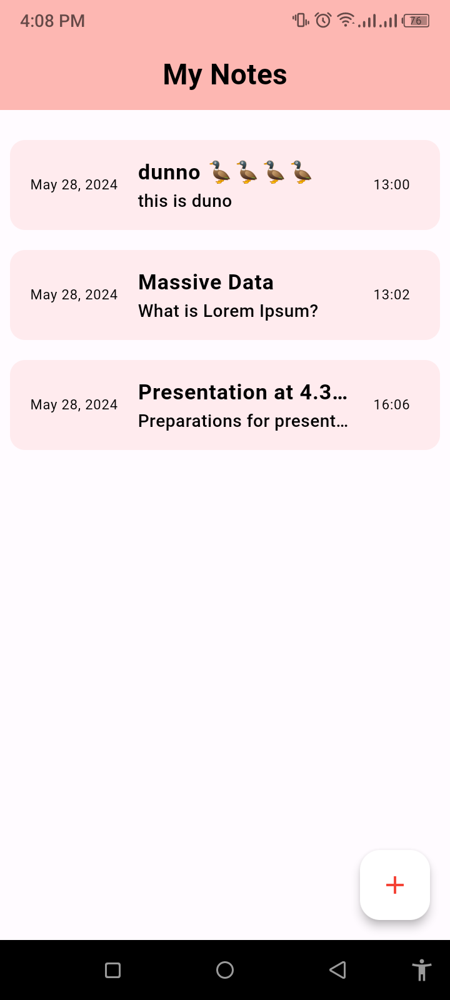

Notepaddy - A Flutter Notepad App with SQFlite  

## Overview:

Introducing Notepaddy, your ultimate notepad app built with Flutter and SQFlite! 📒 Offering a seamless user experience with an intuitive UI, Notepaddy makes note-taking efficient and enjoyable.

## Features:

📝 Add and Edit Notes: Create new notes or edit existing ones effortlessly.

📅 Date and Time Stamping: Automatically timestamps your notes for easy reference.

📂 Organize Your Notes: Sort and manage your notes effectively.

📲 User-Friendly Interface: Enjoy a sleek, modern design that is easy to navigate.

💞 Slide to delete notes: Delete notes in a elegant way

## Screenshots:

           

           

<!--   -->

## How to Use

1. **Installation:**
   - Clone the repository.
   - Install dependencies using `flutter pub get`.

2. **Run the App:**
   - Use `flutter run` to launch the application on your emulator or connected device.

## Technologies Used

- Flutter
- Dart
- SQFlite

## Contributions :
I welcome contributions from the community to enhance Notepaddy's functionality, add new features, or improve the user interface. If you have ideas or improvements, please feel free to submit a pull request.

Happy Note-taking! 📝✨

